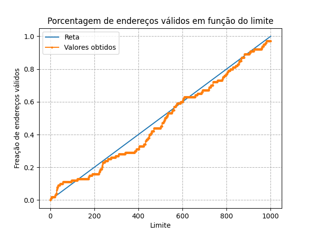

# Respostas:

## Simulação

### Questão 1
- Seed 1 (base = 0x363c; limite = 290):
    - 0x30e -> FORA DOS LIMITES
    - 0x105 -> 0x3741
    - 0x1fb -> FORA DOS LIMITES
    - 0x1cc -> FORA DOS LIMITES
    - 0x29b -> FORA DOS LIMITES
- Seed 2 (base = 0X3CA9; limite = 500):
    - 0x039 -> 0x3ce2
    - 0x056 -> 0x3cff
    - 0x057 -> FORA DOS LIMITES
    - 0x2f1 -> FORA DOS LIMITES
    - 0x2ad -> FORA DOS LIMITES
- Seed 3 (base = 0x22d4; limite = 316):
    - 0x17a -> FORA DOS LIMITES
    - 0x26a -> FORA DOS LIMITES
    - 0x280 -> FORA DOS LIMITES
    - 0x043 -> 0x2317
    - 0x00d -> 0x22e1

### Questão 2
Como o maior endereço é 0x3A1, 929 em decimal, é necessário que o valor de bound seja maior que 929, de modo que o comando que garante que não haja violação de segmentação é `python relocation.py -s 0 -n 10 -l 930`

### Questão 3
Uma vez que a memória física tem 26 KB, o espaço de endereço 1 KB, e o limite é 100 posições de memória, o endereço base máximo deve ser 0x3E1C, ou 15900.  

### Questão 4
Ao reexecutar a seed 1 com 5k de espaço de endereço e 20k de memória física, a nova base é no endereço 0x43CB e o limite 1451, o que gera novos endereços virtuais:
    - 0xf46 -> FORA DOS LIMITES
    - 0x519 -> 0x48E$ (endereço físico)
    - 0x9E8 -> FORA DOS LIMITES
    - 0x8FD -> FORA DOS LIMITES
    - 0xD08 -> FORA DOS LIMITES 

### Questão 5
O gráfico a seguir foi obtido pela execução do arquivo `runcode.py`, que simula a seed 1 com limites variando de 0 a 1000, em que são gerados 100 endereços virtuais. Nota-se que o comportamento se aproxima de uma reta, na medida que enquanto o limite se aproxima do espaço de endereçamento, a fração de endereços virtuais válidos se aproxima de 1, o que indica que o número de endereços virtuais válidos se aproxima da totalidade. 

