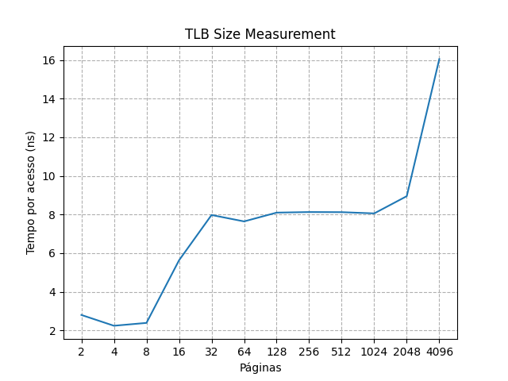

# Respostas:

## Medição  

### Questão 1
Uma vez que o tempo de acesso ao cache é da ordem de nanossegundos, é preciso que o tempo de acesso à função de tempo seja superior a essa ordem.

### Questão 2 / 3
O programa utilizado é o do arquivo `tlb.c`. Nele, foram feitos testes com 2,4,8,...,8192 páginas, cada um com 1000000 iterações. O código utiliado é o seguinte:
```c
#include <stdlib.h>
#include <string.h>
#include <stdio.h>
#include <time.h>    

int main(int argc, char *argv[]){

    if (argc == 3){
        for (int pg = 2; pg <= 16384; pg*=2){
            int NUMPAGES = pg, PAGESIZE = 1048576   /*1 MB*/;
            long int NUMTRIALS = atoi(argv[2]);
            int jump = PAGESIZE / sizeof(int);
            int size = (int) (NUMPAGES * jump);
            int *a;
            a = (int*) malloc((unsigned long int) NUMPAGES * jump * sizeof(int));
            struct timespec start, end;
            double tempo_de_acesso;
            long int counter = 1; 
            timespec_get(&start, TIME_UTC);
            while (counter <= NUMTRIALS){
                for (unsigned long int i = 0; i < NUMPAGES * jump; i += jump){
                    a[i] += 1;
                }
                counter++;
            }
            timespec_get(&end, TIME_UTC);
            long int nanoseconds = (end.tv_sec - start.tv_sec)*1000000000 + (end.tv_nsec - start.tv_nsec);
            tempo_de_acesso = ((double) nanoseconds) / ((unsigned long int) NUMTRIALS*NUMPAGES);
            printf("%d                          %.5f ns\n", pg, tempo_de_acesso);
            free(a);
        }
    }
    return 0;
}
``` 

### Questão 4

O grafo feito é mostrado a seguir:



Nota-se que há 2 intervalos em que o tempo de acesso é próximo a uma constante: até cerca de 8 páginas e entre 32 e 1024 páginas, o que indica que a máquina tem ao menos  níveis de TLB: o segundo com capacidade de cerca de 8 MB e o segundo com capacidade de cerca de 1 GB

### Questão 5
A otimização do compilador pode ser removida pela adição de flags na compilação.

### Questão 6
Pode haver alguma adição de tempo na mudança de CPUs, o que poode comprometer os resultados das medições. 

