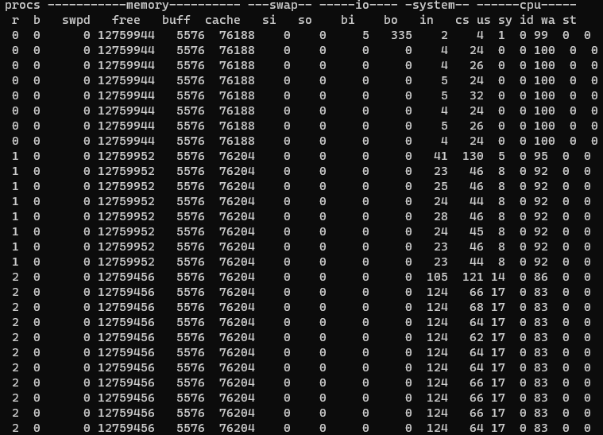
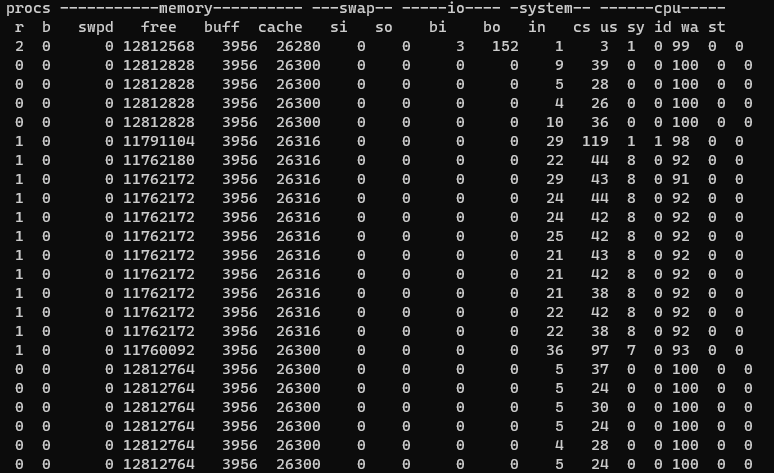
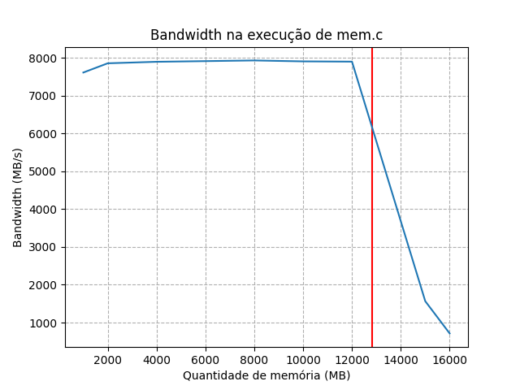

# Respostas:

## Medição  

### Questão 1
Quando `mem` é executada, o número de processos aumenta, assim como o user time e a quantidade de memória livre diminui. Se mais uma instância de `mem` é executada, o número de processos passa a ser 2, o user time aumenta novamente e a memória livre diminui. A cada vez é iniciado um novo processo, há um pico no número de context switches, o que é de se esperar uma vez ue o SO deve iniciar um novo contexto para o processo. Com mais prcessos sendo executados, faz sentido que o user time aumente, dado que o SO passa mais tempo executando as intruções no modo de usuário.

### Questão 2 
`free` diminui quando o programa executa e volta a aumentar quando o programa é encerrado.`swpd` permanece 0 durante toda a execução - isso pode ser relacoinado ao fato de que o programa é rodado no Windows Subsystem for Linux, que é uma virtualização de um sistema Linux, e não uma máquina real. Ao encerrar o programa, a memória livre aumenta em 1.052.672 KB, ou 1028 MB, o que é próximo do valor esperado de 1024 MB.

### Questão 3 / 4
Se o programa é rodado com uma capacidade maior que a memória da máquina, os valores em `swap` deixam de ser 0, `swpd` aumenta consideravelmente, assim como o número de context switches

### Questão 5
O grafo criado é mostrado a seguir. A linha vermelha indica a memória indicada como livre por `vmstat`.

### Questão 6
Pode haver alguma adição de tempo na mudança de CPUs, o que poode comprometer os resultados das medições. 

