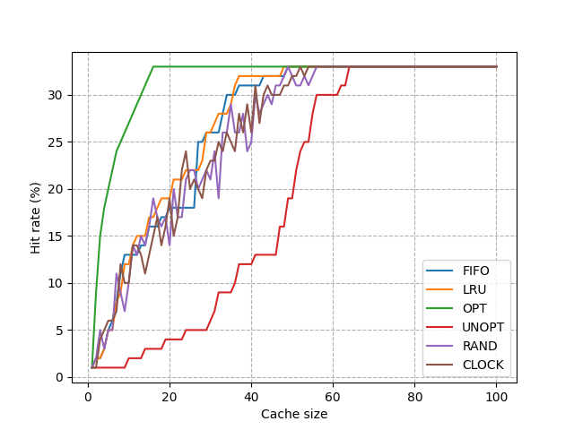
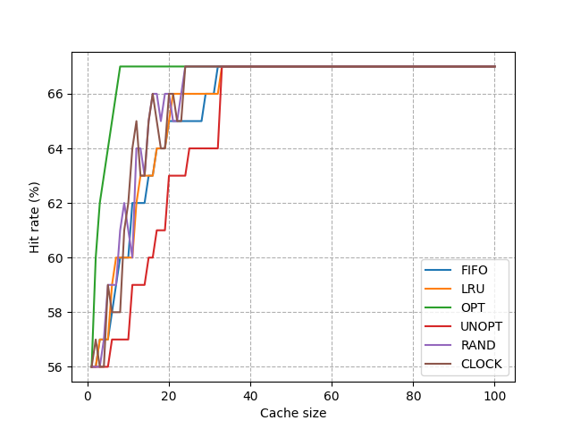

# Respostas:

## Simulação  

### Questão 1
- `python paging-policy.py -s 0 -n 10`
    - FIFO:
        - Access: 8 -> miss [8]
        - Access: 7 -> miss [8, 7]
        - Access: 4 -> miss [8, 7, 4]
        - Access: 2 -> miss [2, 7, 4]
        - Access: 5 -> miss [2, 5, 4]
        - Access: 4 -> hit [2, 5, 4]
        - Access: 7 -> miss [2, 5, 7]
        - Access: 3 -> miss [3, 5, 7]
        - Access: 4 -> miss [3, 4, 7]
        - Access: 5 -> miss [3, 4, 5]
    - LRU:
        - Access: 8 -> miss [8]
        - Access: 7 -> miss [8, 7]
        - Access: 4 -> miss [8, 7, 4]
        - Access: 2 -> miss [2, 7, 4]
        - Access: 5 -> miss [2, 5, 4]
        - Access: 4 -> hit [2, 5, 4]
        - Access: 7 -> miss [4, 5, 7]
        - Access: 3 -> miss [3, 4, 7]
        - Access: 4 -> hit [3, 4, 7]
        - Access: 5 -> miss [3, 4, 5]
    - OPT:
        - Access: 8 -> miss [8]
        - Access: 7 -> miss [8, 7]
        - Access: 4 -> miss [8, 7, 4]
        - Access: 2 -> miss [2, 7, 4]
        - Access: 5 -> miss [5, 7, 4]
        - Access: 4 -> hit [5, 7, 4]
        - Access: 7 -> hit [5, 7, 4]
        - Access: 3 -> miss [5, 3, 4]
        - Access: 4 -> hit [5, 3, 4]
        - Access: 5 -> hit [5, 3, 4]

### Questão 2 
Se denominarmmos o número de cada página or uma letra, os piores casos de cada política é mostrado a seguir:
- FIFO:
    - Acesso: A -> miss [A]
    - Acesso: B -> miss [A,B]
    - Acesso: C -> miss [A,B,C]
    - Acesso: D -> miss [A,B,C,D]
    - Acesso: E -> miss [A,B,C,D,E]
    - Acesso: F -> miss [F,B,C,D,E]
    - Acesso: A -> miss [F,A,C,D,E]
    - Acesso: B -> miss [F,A,B,D,E]
    - ...
- LRU:
    - Acesso: A -> miss [A]
    - Acesso: B -> miss [A,B]
    - Acesso: C -> miss [A,B,C]
    - Acesso: D -> miss [A,B,C,D]
    - Acesso: E -> miss [A,B,C,D,E]
    - Acesso: F -> miss [F,B,C,D,E]
    - Acesso: A -> miss [F,A,C,D,E]
    - Acesso: B -> miss [F,A,B,D,E]
    - ...
- MRU:
    - Acesso: A -> miss [A]
    - Acesso: B -> miss [A,B]
    - Acesso: C -> miss [A,B,C]
    - Acesso: D -> miss [A,B,C,D]
    - Acesso: E -> miss [A,B,C,D,E]
    - Acesso: F -> miss [A,B,C,D,F]
    - Acesso: E -> miss [A,B,C,D,E]
    - ...

### Questão 3 
Um gráfico do hit rate de cada política no acesso a 100 páginas aleatórias para caches de diferentes tamanhos é mostrado no gráfico a seguir:

### Questão 4
No gráfico a seguir, as páginas foram escolhidas com 50% de chance de que fossem repetidas na chamada seguinte

