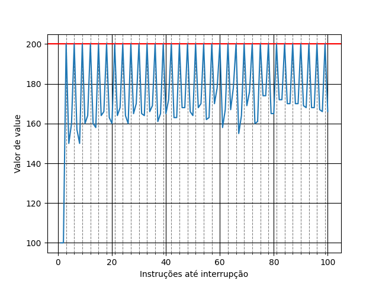

# Respostas:

## Simulação  

### Questão 1
O valor de dx após a execução de `x86.py -p loop.s -t 1 -i 100 -R dx` pode ser descrito como:
- Valor inicial: 0
- Instrução 1 -> -1
- Instrução 2 -> -1
- Instrução 3 -> -1
- Instrução 4 -> -1

### Questão 2
O valor de dx após a execução de `x86.py -p loop.s -t 2 -i 100 -a dx=3,dx=3 -R dx` pode ser descrito como:
- Valor inicial: 3
- (T0) Instrução 1 -> 3
- (T0) Instrução 2 -> 2
- (T0) Instrução 3 -> 2
- (T0) Instrução 4 -> 2
- (T0) Instrução 5 -> 1
- (T0) Instrução 6 -> 1
- (T0) Instrução 7 -> 1
- (T0) Instrução 8 -> 0
- (T0) Instrução 9 -> 0
- (T0) Instrução 10 -> 0
- (T0) Instrução 11 -> -1
- (T0) Instrução 12 -> -1
- (T0) Instrução 13 -> -1
- SWITCH -> 3
- (T1) Instrução 14 -> 2
- (T1) Instrução 15 -> 2
- (T1) Instrução 16 -> 2
- (T1) Instrução 17 -> 1
- (T1) Instrução 18 -> 1
- (T1) Instrução 19 -> 1
- (T1) Instrução 20 -> 0
- (T1) Instrução 21 -> 0
- (T1) Instrução 22 -> 0
- (T1) Instrução 23 -> -1
- (T1) Instrução 24 -> -1
- (T1) Instrução 25 -> -1
- (T1) Instrução 26 -> -1

Há uma *race* no código, uma vez que ambas as threads utilizam o registrador dx, que portanto pode não estar atualizado quando uma nova thread se inicia. 

### Questão 3
O valor de dx após a execução de `x86.py -p loop.s -t 2 -i 3 -r -a dx=3,dx=3 -R dx` pode ser descrito como:
- Valor inicial: 3          
- (T0) Instrução 1 -> 2
- (T0) Instrução 2 -> 2
- (T0) Instrução 3 -> 2
- INTERRUPT -> 3
- (T1) Instrução 4 -> 2 
- (T1) Instrução 5 -> 2
- (T1) Instrução 6 -> 2
- INTERRUPT -> 2 
- (T0) Instrução 7 -> 1
- (T0) Instrução 8 -> 1
- INTERRUPT -> 2
- (T1) Instrução 9 -> 1
- INTERRUPT -> 1
- (T0) Instrução 10 -> 1
- (T0) Instrução 11 -> 0
- INTERRUPT -> 1
- (T1) Instrução 12 -> 1
- (T1) Instrução 13 -> 1
- INTERRUPT -> 0
- (T0) Instrução 14 -> 0
- (T0) Instrução 15 -> 0
- (T0) Instrução 16 -> -1
- INTERRUPT -> 1
- (T1) Instrução 17 -> 0
- INTERRUPT -> -1
- (T0) Instrução 18 -> -1
- (T0) Instrução 19 -> -1
- INTERRUPT -> 0
- (T1) Instrução 20 -> 0
- (T1) Instrução 21 -> 0
- INTERRUPT -> -1
- (T0) Instrução 22 -> -1
- SWITCH -> 0
- (T1) Instrução 23 -> -1
- (T1) Instrução 24 -> -1
- INTERRUPT -> -1
- (T1) Instrução 25 -> -1
- (T1) Instrução 26 -> -1

A frequência maior de mudança de threads ainda faz com que durante a execução do programa, os valores de dx para cada thread sejam diferentes, de modo que a *race* é intensificada.

### Questão 4
O valor de *value* após a execução de `x86.py -p looping-race-nolock.s -t 1 -M 2000` pode ser descrito como:
```sh
 Value      Thread 0  
    0  
    0   1000 mov 2000, %ax  
    0   1001 add $1, %ax  
    1   1002 mov %ax, 2000  
    1   1003 sub  $1, %bx  
    1   1004 test $0, %bx  
    1   1005 jgt .top  
    1   1006 halt  
```

### Questão 5
O valor de *value* após a execução de `x86.py -p looping-race-nolock.s -t 2 -a bx=3 -M 2000` pode ser descrito como:
```sh
 Value         Thread 0                Thread 1
    0
    0   1000 mov 2000, %ax
    0   1001 add $1, %ax
    1   1002 mov %ax, 2000
    1   1003 sub  $1, %bx
    1   1004 test $0, %bx
    1   1005 jgt .top
    1   1000 mov 2000, %ax
    1   1001 add $1, %ax
    2   1002 mov %ax, 2000
    2   1003 sub  $1, %bx
    2   1004 test $0, %bx
    2   1005 jgt .top
    2   1000 mov 2000, %ax
    2   1001 add $1, %ax
    3   1002 mov %ax, 2000
    3   1003 sub  $1, %bx
    3   1004 test $0, %bx
    3   1005 jgt .top
    3   1006 halt
    3   ----- Halt;Switch -----  ----- Halt;Switch -----
    3                            1000 mov 2000, %ax
    3                            1001 add $1, %ax
    4                            1002 mov %ax, 2000
    4                            1003 sub  $1, %bx
    4                            1004 test $0, %bx
    4                            1005 jgt .top
    4                            1000 mov 2000, %ax
    4                            1001 add $1, %ax
    5                            1002 mov %ax, 2000
    5                            1003 sub  $1, %bx
    5                            1004 test $0, %bx
    5                            1005 jgt .top
    5                            1000 mov 2000, %ax
    5                            1001 add $1, %ax
    6                            1002 mov %ax, 2000
    6                            1003 sub  $1, %bx
    6                            1004 test $0, %bx
    6                            1005 jgt .top
    6                            1006 halt
```
Cada thread percorre o loop 3 vezes pois bx tem o valor 3 no início de cada uma, de modo que cada vez que é decrementado de 1, se for maior ou igual a 0, o programa volta ao início do loop, o que resulta em três loops por thread. Após a execução das threads, *value* tem valor 6.

### Questão 6
- O valor de *value* após a execução de `x86.py -p looping-race-nolock.s -t 2 -M 2000 -i 4 -r -s 0` pode ser descrito como:
```sh
 Value        Thread 0                Thread 1
    0
    0   1000 mov 2000, %ax
    0   1001 add $1, %ax
    1   1002 mov %ax, 2000
    1   1003 sub  $1, %bx
    1   ------ Interrupt ------  ------ Interrupt ------
    1                            1000 mov 2000, %ax
    1                            1001 add $1, %ax
    2                            1002 mov %ax, 2000
    2                            1003 sub  $1, %bx
    2   ------ Interrupt ------  ------ Interrupt ------
    2   1004 test $0, %bx
    2   1005 jgt .top
    2   ------ Interrupt ------  ------ Interrupt ------
    2                            1004 test $0, %bx
    2                            1005 jgt .top
    2   ------ Interrupt ------  ------ Interrupt ------
    2   1006 halt
    2   ----- Halt;Switch -----  ----- Halt;Switch -----
    2                            1006 halt
```
- O valor de *value* após a execução de `x86.py -p looping-race-nolock.s -t 2 -M 2000 -i 4 -r -s 1` pode ser descrito como:
```sh
 Value        Thread 0                Thread 1
    0
    0   1000 mov 2000, %ax
    0   ------ Interrupt ------  ------ Interrupt ------
    0                            1000 mov 2000, %ax
    0                            1001 add $1, %ax
    1                            1002 mov %ax, 2000
    1                            1003 sub  $1, %bx
    1   ------ Interrupt ------  ------ Interrupt ------
    1   1001 add $1, %ax
    1   1002 mov %ax, 2000
    1   1003 sub  $1, %bx
    1   1004 test $0, %bx
    1   ------ Interrupt ------  ------ Interrupt ------
    1                            1004 test $0, %bx
    1                            1005 jgt .top
    1   ------ Interrupt ------  ------ Interrupt ------
    1   1005 jgt .top
    1   1006 halt
    1   ----- Halt;Switch -----  ----- Halt;Switch -----
    1   ------ Interrupt ------  ------ Interrupt ------
    1                            1006 halt
```
Uma vez que a troca de thread ocorreu entre o load de *value* em ax, sua modificação por uma thread e seu store na memória, a thread 0 não "notou" a atualização de valeue pela thread 1, de modo que atualizou esse valor na memória uma segunda vez para 1. Desse modo, a seção crítica do programa é o conjunto de instruções
```
mov 2000, %ax
add $1, %ax
mov %ax, 2000
```
o que significa que interrupções não podem ocorrer entre qualquer uma dessas instruções para que não haja uma competição entre as threads.

### Questão 7
- O valor de *value* após a execução de `x86.py -p looping-race-nolock.s -a bx=1 -t 2 -M 2000 -i 1` pode ser descrito como:
```sh
 Value        Thread 0                Thread 1
    0
    0   1000 mov 2000, %ax
    0   ------ Interrupt ------  ------ Interrupt ------
    0                            1000 mov 2000, %ax
    0   ------ Interrupt ------  ------ Interrupt ------
    0   1001 add $1, %ax
    0   ------ Interrupt ------  ------ Interrupt ------
    0                            1001 add $1, %ax
    0   ------ Interrupt ------  ------ Interrupt ------
    1   1002 mov %ax, 2000
    1   ------ Interrupt ------  ------ Interrupt ------
    1                            1002 mov %ax, 2000
    1   ------ Interrupt ------  ------ Interrupt ------
    1   1003 sub  $1, %bx
    1   ------ Interrupt ------  ------ Interrupt ------
    1                            1003 sub  $1, %bx
    1   ------ Interrupt ------  ------ Interrupt ------
    1   1004 test $0, %bx
    1   ------ Interrupt ------  ------ Interrupt ------
    1                            1004 test $0, %bx
    1   ------ Interrupt ------  ------ Interrupt ------
    1   1005 jgt .top
    1   ------ Interrupt ------  ------ Interrupt ------
    1                            1005 jgt .top
    1   ------ Interrupt ------  ------ Interrupt ------
    1   1006 halt
    1   ----- Halt;Switch -----  ----- Halt;Switch -----
    1   ------ Interrupt ------  ------ Interrupt ------
    1                            1006 halt
```
Nota-se que o aumento na frequência de interrpções aumenta a probabilidade que ambas as threads atualizem *value* para o mesmo valor. Se for testada com interrupções a cada 3 instruções (`x86.py -p looping-race-nolock.s -a bx=1 -t 2 -M 2000 -i 3`), o programa tem a "resposta" esperada:
```sh
 Value        Thread 0                Thread 1
    0
    0   1000 mov 2000, %ax
    0   1001 add $1, %ax
    1   1002 mov %ax, 2000
    1   ------ Interrupt ------  ------ Interrupt ------
    1                            1000 mov 2000, %ax
    1                            1001 add $1, %ax
    2                            1002 mov %ax, 2000
    2   ------ Interrupt ------  ------ Interrupt ------
    2   1003 sub  $1, %bx
    2   1004 test $0, %bx
    2   1005 jgt .top
    2   ------ Interrupt ------  ------ Interrupt ------
    2                            1003 sub  $1, %bx
    2                            1004 test $0, %bx
    2                            1005 jgt .top
    2   ------ Interrupt ------  ------ Interrupt ------
    2   1006 halt
    2   ----- Halt;Switch -----  ----- Halt;Switch -----
    2                            1006 halt
```

### Questão 8
Um gráfico que relaciona *value* com a frequência de interrupções é mostrado a seguir:



Para 100 iterações do processo com duas threads, nota-se que *value* atinge o valor esperado, 200, se o número de instruções até cada interrupção é múltiplo de 3 – indicados pelas linhas pontilhadas – que é exatamente o número de instruções da seção crítica. O menor valor de *value* foi 100, obtido quando uma interrupção era feita a cada instrução. Os menores valores seguintes ocorreram em intervalos de 4 e 8 e é possível notar um padrão de valores menores em múltiplos de 4, a não ser no intervalo de 67 instruções, que o valor se mostrou excepcionalmente mnor que os outros a seu redor.  

### Questão 9
- O valor de *value* após a execução de `x86.py -p wait-for-me.s -a ax=1,ax=0 -R ax -M 2000` pode ser descrito como:
```sh
 Value    ax          Thread 0                Thread 1
    0       1
    0       1   1000 test $1, %ax
    0       1   1001 je .signaller
    1       1   1006 mov  $1, 2000
    1       1   1007 halt
    1       0   ----- Halt;Switch -----  ----- Halt;Switch -----
    1       0                            1000 test $1, %ax
    1       0                            1001 je .signaller
    1       0                            1002 mov  2000, %cx
    1       0                            1003 test $1, %cx
    1       0                            1004 jne .waiter
    1       0                            1005 halt
```