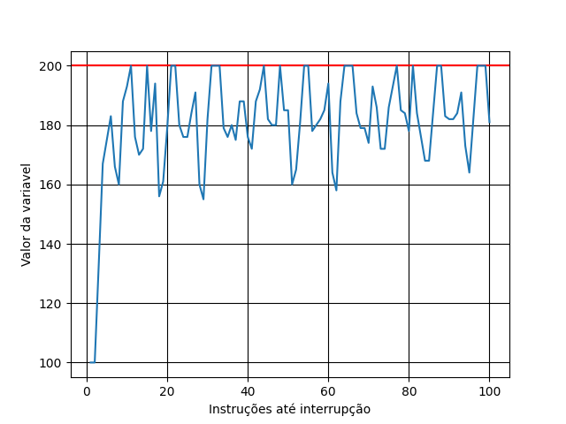
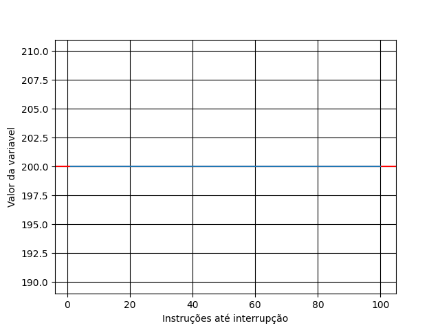

# Respostas:

## Simulação  

### Questão 1
O trecho `.acquire` representa um loop de ma thread que tenta adquirir o lock: enquanto for diferente de 1, a lock está "ocupada", de modo qe o valor continua sendo testado até que esteja livre. Quando está livre, é setada em 1, acessada a região crítica e, finalmente, liberada a lock para outra thread.

### Questão 2
Nesse caso, com os parâmetros padrão, o código funciona como esperado: nenhuma thread interrompe a execuçõ da seção cítica da outra, como pode ser notado pelo fato de que ax = count.
```sh
count  flag      ax    bx          Thread 0                Thread 1

    0     0       0     0
    0     0       0     0   1000 mov  flag, %ax
    0     0       0     0   1001 test $0, %ax
    0     0       0     0   1002 jne  .acquire
    0     1       0     0   1003 mov  $1, flag
    0     1       0     0   1004 mov  count, %ax
    0     1       1     0   1005 add  $1, %ax
    1     1       1     0   1006 mov  %ax, count
    1     0       1     0   1007 mov  $0, flag
    1     0       1    -1   1008 sub  $1, %bx
    1     0       1    -1   1009 test $0, %bx
    1     0       1    -1   1010 jgt .top
    1     0       1    -1   1011 halt
    1     0       0     0   ----- Halt;Switch -----  ----- Halt;Switch -----
    1     0       0     0                            1000 mov  flag, %ax
    1     0       0     0                            1001 test $0, %ax
    1     0       0     0                            1002 jne  .acquire
    1     1       0     0                            1003 mov  $1, flag
    1     1       1     0                            1004 mov  count, %ax
    1     1       2     0                            1005 add  $1, %ax
    2     1       2     0                            1006 mov  %ax, count
    2     0       2     0                            1007 mov  $0, flag
    2     0       2    -1                            1008 sub  $1, %bx
    2     0       2    -1                            1009 test $0, %bx
    2     0       2    -1                            1010 jgt .top
    2     0       2    -1                            1011 halt
```
### Questão 3
Nesse caso, com o comando `x86.py -p flag.s -M count,flag -R ax,bx -a bx=2,bx=2` são feitos 2 loops para cada thread, o que significaria que o resultado de count deveria ser 4. De fato, esse resultado é igual ao obtido, como pode ser visto no trecho do output mostrado a seguir.
```sh
count  flag      ax    bx          Thread 0                Thread 1

    0     0       0     2
    0     0       0     2   1000 mov  flag, %ax
    0     0       0     2   1001 test $0, %ax

    .     .       .     .            .                        . 
    .     .       .     .            .                        . 
    .     .       .     .            .                        . 


    4     0       4     0                            1010 jgt .top
    4     0       4     0                            1011 halt
```

### Questão 4
O resultado pode ser visto no gráfico a seguir, para 2 threads e até 100 lops para cada thread



### Questão 5
O *lock acquire* é escrito pelo swap de mutex e 1. Se o resultado for 0, a lock está livre para ser usada. DDDDmesma maneira, a lock é liberada setando mutex para 0. 

### Questão 6
O resultado pode ser visto no gráfico a seguir, para 2 threads e até 100 lops para cada thread



Nota-se que o resultado é sempre igual ao esperado, 200.

### Questão 8
O algoritmo faz com que cada thread tenha sua flag espercífica. Durante a execução de uam thread X, é verificado se é "sua vez" de tomar o lock acessando o vetor *flag*

### Questão 9
Para diferentes valores de *i*, o programa ainda tem o resultado esperado: o valor da variável modifcada permanece 2, independentemente do valor de *i*.

### Questão 12
Com três threads, cada thread do programa trabalha de maneira aproximadamente igual, mas o tempo de execução do programa aumenta consideravelmente e o resultado ainda se mantem igual ao esperado.
