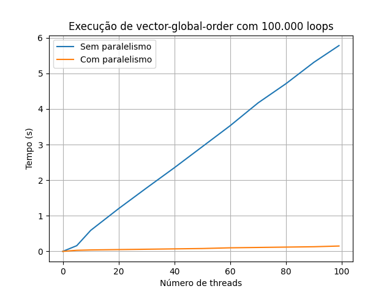
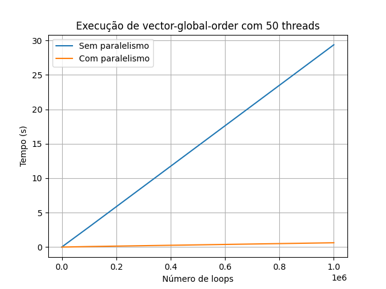
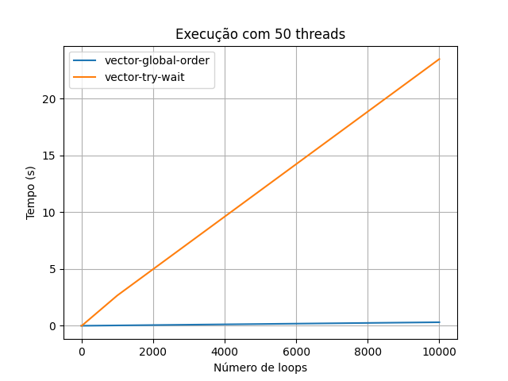
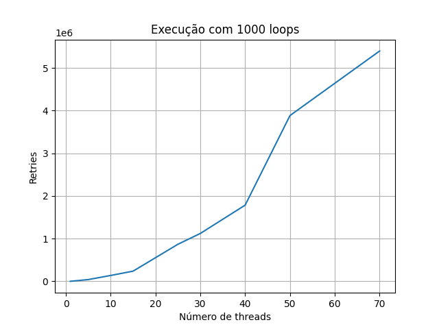

# Respostas:

## Código  

### Questão 1
Em algumas execuções, a ordem das threads muda.

### Questão 2
em algumas execuções, o programa trava, o que indica a ocorrência de um deadlock. A presença de deadlocks foinotada especialmente com um número maior de iterações.

### Questão 3
Como há mais threads, há mais chance de que haja locks interdependentes, o que causa um deadlock Desse modo, aumentar o número de threads aumenta a chance de deadlock. Por esse motivo, é impossível ter uma deadlock em uma única thread.

### Questão 4
O código evita deadlocks ao aplicar uma ordenação arcial na setagem das locks, que depende dos endereços dos vetores. Caso os vetores sejam os mesmos, somente uma lock é aplicada, o que elimina uma interdependência.

### Questão 5
Com a configuração `./vector-global-order  -t -n 2 -l 100000 -d`, o código leva 0,02 segundos para ser completo. Se forem aumentados o número de loops ou de threads, o tempo de execução tembém aumenta.

### Questão 6
A execução do código é muito mais rápida com paralelismo habilitado, como pode ser visto nos gráficos. Nota-se que em ambos os casos, o tempo cresce de maneira próxima à linear em relação ao número de threads

### Questão 7
A chamada a `pthread mutex trylock()` não é necessária, dado que sua execução somente retorna ao topo. Nota-se que a abordagem try-wait é muito mais lenqua que a anterior. 

### Questão 9
Essa versão utiliza a abordagem fetch-and-add, que tenta executar as operações atomicamente. Se a operação de soma for considerada perfeitamente atômica, um lock não será necesário.